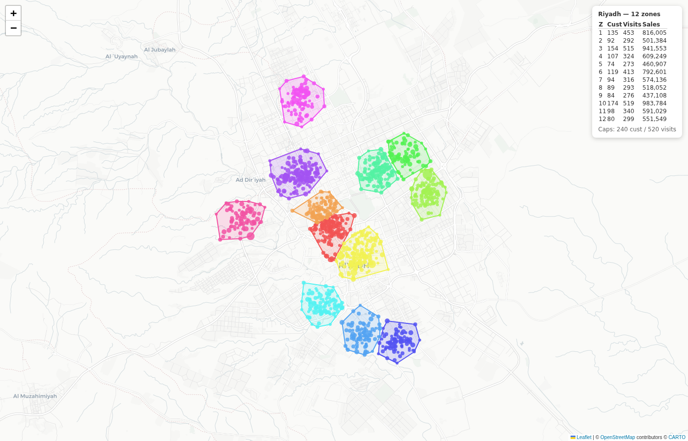

# Sales Territory Optimizer

Cluster customer GPS points into **balanced, contiguous sales-rep territories**,
respect capacity caps, generate **district-level KML polygons**, an **interactive
HTML map**, and a **two-tab Excel workbook** — fully parameterized so you can
re-run it on any city.

Built as a working demo for a cash-van / field-sales territory design task
(Riyadh & Dammam, replicating an existing Jeddah model). The sample data here
is **synthetic** — points seeded around real Riyadh district centroids. No real
customer data is included.



## What it does

```
customers.csv ─▶ frequency matrix ─▶ geographic clustering ─▶ capacity balancing ─▶ outputs
 (id, lat, lon,     (value × activity     (KMeans seed,         (move BORDER customers    ├─ interactive map (HTML)
  4-mo sales)        → visits/month)       lon scaled by         between ADJACENT zones    ├─ zone polygons (KML)
                                            cos(lat))             until caps satisfied)     ├─ assignments (CSV/XLSX)
                                                                                            └─ zone summary + cap checks
```

### Method, briefly
1. **Recommended visits** per customer come from a frequency matrix
   (value tier × activity tier → visits/month). Inactive customers → 0 visits.
   Drop in the client's exact Jeddah grid by editing one dict.
2. **Geographic seeds** via KMeans on lat/lon, with longitude scaled by
   `cos(lat)` so Euclidean distance approximates ground distance.
3. **Capacity balancing** moves only **border** customers from an over-capacity
   zone to the **nearest adjacent** under-capacity zone. Because only border
   points move, zones stay contiguous — no islands.
4. **Boundaries** are convex hulls per zone (swap in `alphashape` for concave
   boundaries in production), exported to KML for Google Earth / Maps.

### Capacity caps (all configurable)
- Customer cap: **240** per rep (soft target)
- Visit cap: **20 visits/day × 26 days = 520/month** (hard cap)
- Target zones: **12** (data may justify ±2)

## Quick start

```bash
pip install -r requirements.txt

# 1. generate synthetic Riyadh data (or supply your own CSV)
python src/make_demo_data.py --n 1300 --out sample_data/riyadh_customers.csv

# 2. run the full pipeline -> map + KML + Excel
python src/build_outputs.py --input sample_data/riyadh_customers.csv \
    --city Riyadh --zones 12 --customer-cap 240 --out demo_output
```

### Re-run on a new city
Point `--input` at that city's CSV and change `--city`. Tune `--zones`,
`--customer-cap`, `--visits-per-day`, `--working-days` as needed:

```bash
python src/build_outputs.py --input sample_data/dammam_customers.csv \
    --city Dammam --zones 10 --customer-cap 240
```

## Input format
| column | meaning |
|---|---|
| `customer_id` | unique key |
| `lat`, `lon` | GPS coordinates |
| `avg_monthly_sales` | mean monthly sales over the 4-month window |
| `avg_monthly_invoices` | mean monthly invoice/visit count |
| `sales_m1..m4`, `invoices_m1..m4` | optional per-month detail |

## Outputs (`demo_output/`)
| file | contents |
|---|---|
| `<city>_territory_map.html` | standalone Leaflet map: colored zones, customer points sized by sales, clickable popups, summary panel |
| `<city>_zones.kml` | one polygon per territory, named + styled, opens in Google Earth |
| `<city>_territories.xlsx` | `assignments` tab + `zone_summary` tab with 240/520 cap checks |

## Files
```
src/territory_optimizer.py   core: frequency matrix, clustering, balancing, polygons
src/build_outputs.py         map + KML + Excel builders
src/make_demo_data.py        synthetic Riyadh data generator
```

— Dr. Sandeep Grover
